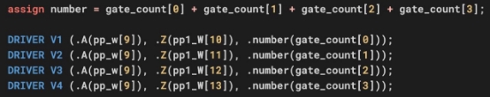

***IC Design*** 

***Homework # 4*** 

**Problem Specification** 

Design a circuit with reset that computes the **approximation of the sigmoid function**. There are two input signals for the circuit, i.e., i\_x with 8 bits, and a 1-bit i\_in\_valid. The i\_x is a fixed-point format with a 1-bit sign, 2-bit integer, and 5-bit fraction.  The  circuit  contains  two  output  signals,  i.e.,  up  to  16-bit  o\_y  for  the approximation output value, and a 1-bit o\_out\_valid. The o\_y is a fixed-point format with 1-bit integer and up to 15-bit fraction, and you don't need to use all 15 bits for your design's output. Note that **the input signal is signed,** and **the output signal is unsigned.** The relation between the input and the output signals is 

Y ≅ sigmoid(x) = 1/(1 + e^-x)

`     `You are encouraged to use piecewise-linear approximation to design your circuit. For example, Figure 1 uses three segments to approximate the real function, while Figure 2 uses 5 segments. Figure 2 is more accurate than Figure 1, but its cost is using more transistors in the circuit because it needs to calculate more slopes. This is a tradeoff, so it is important to think about what your approximation function is before designing the circuit. Note that this homework only considers the range of [-4, 4). 

The following diagram illustrates the relation between your design and the testbench. Pull up “o\_out\_valid” and output your answer to “o\_y[15:0]” once your circuit finishes the calculation, the testbench will then check your answers. Note that the output signals: “o\_y[15:0]” and “o\_out\_valid” must be registered, i.e., they are outputs of DFFs **(use module FD2 (positive edge) in lib.v )**.  

**Timing Diagram** 

When your design is simulated in testbench, the circuit would only be reset once. After reset, **new values of i\_x would be input at every cycle**. Besides, **o\_out\_valid should  remain  high  once  it  is  pulled  up**,  and  the  order  of  input  i\_x  and  their corresponding output o\_y should not be changed (**First in, first out**.). 

**Signals Description** 

|**Signal name** |**I/O** |**Width** |**Simple description** |
| - | - | - | - |
|clk |Input |1 |Clock signal. |
|rst\_n |Input |1 |Active low asynchronous reset. |
|i\_in\_valid |Input |1 |Indicate that the input is valid. |
|i\_x |Input |8 |Input X. |
|o\_y |Output |16 |Approximate output Y. Up to 15 bits fraction. |
|o\_out\_valid |Output |1 |Indicate that the calculation was finished. |
|number |Output |51 |The number of transistors. |

**Design Rules** 

**Those who do not design according to the following rules will not be graded.** 

- **LUT-based designs are not allowed.** 
- There should be a **reset signal** for the register. 
- You are free to add pipeline registers. 
- You can loosen your simulation timing first, (i.e.,  **define  CYCLE   XXXX** in the tb.v), then shorten the clock period to find your critical path. 
- Your  design  should  be  based  on  the  **standard  cells  in  the  lib.v**.  All  logic operations in your design **MUST consist of the standard cells** instead of using the operands such as “+”, “-”, “&”, “|”, “>”, and “<”. 
- Using “assign” to concatenate signals or specify constant values is allowed. 
- Design your homework in the given “sigmoid.v” file. **You are NOT ALLOWED to change the filename and the header of the top module (i.e. the module name and the I/O ports)**. 
- If your design contains more than one module, **don’t create a new file for them**, just put those modules in “sigmoid.v.” 

**Grading Policy** 

1. ***Gate-level design using Verilog (70%)*** 

Your score will depend on both the approximation error and performance of your design. 

1) ***Approximation Error Score (35%)*** 

At  this  stage,  we  will  evaluate  how  much  the  value  of  the  sigmoid  module approximates the real one. Time and area are not considered. We provide a testbench with a total of 256 patterns, whose distribution is in [-4, 4), and 16-bit format. There will be a ranking according to mean square error (MSE): 

255 (Yapproximate,i − Y )2

∑ real,i 

.

i=0 256

2) ***Performance Score (35%)*** 

At this stage, you need to **add up the number of transistors of all used cells in the div module and connect it to number [50:0]**. 

Only in this section, you are allowed to use “+” to help with calculations. 

We will rank all students according to **A\*T**, where A represents the **number of transistors** and T represents the **total execution time**.  

Your approximation error score and performance score will be graded by your ranking according to the table below, respectively. 

|**Percentage of students** |**Approx. Error Score** |**Performance Score** |
| - | - | - |
|If your ranking is> 90 % |35 |35 |
|80% ~ 90% |32 |32 |
|70% ~ 80% |28 |28 |
|60% ~ 70% |25 |25 |
|50% ~ 60% |21 |21 |
|40% ~ 50% |18 |18 |
|30% ~ 40% |14 |14 |
|20% ~ 30% |11 |11 |
|10% ~ 20% |7 |7 |
|0% ~ 10% |4 |4 |
|Not using standard cell logic |0 |0 |
|Plagiarism |0 |0 |
|Incorrect number connection |0 |0 |

2. ***Report (30%)*** 
1) ***Simulation (0%)*** 

Specify your **minimum cycle time**. If you do not provide this information, **You** **will not get any score** for** part 1 (70%)”**.** **This minimum cycle time would be verified by TAs.** Also, please put the screenshot of the summary provided by the testbench in the report. 

2) ***Circuit diagram (10%)*** 

You are encouraged to use software to draw the architecture **instead of hand drawing**. Plot it **hierarchically** so that readers can understand your design easily. **All of the above will improve your report score.** 

(5%) Plot the gate-level circuit diagram of your design. 

(5%) Plot the critical path on the diagram above. 

3) ***Discussion (20%)*** 

Discuss your design. 

- (5%) Introduce your design. 
- (5%) How do you improve your critical path and the number of transistors? 
- (5%) How do you trade-off between area and speed? 
- (5%) Compare with other architectures you have designed (if any). 

**Notification** 

Following are the files HW4.zip includes  

- **HW4\_2023.pdf:** This document. 
- **HW4\_tutorial\_2023.pdf:** Tutorial in class. 
- **sigmoid.v:** 

Dummy design file. Program the design in this file. 

The  header  of  the  top  module  and  the  declaration  of  the  I/O  ports  are predefined in this file and you are not allowed to change them. 

- **lib.v:**  

Standard cells. 

- **tb.v:** 

The testbench for your design. 

- **pattern/Inn.dat:** 

Input patterns for the testbench. Please keep the hierarchy when simulation. 

- **pattern/Gol.dat:** 

Patterns of the real hyperbolic tangent values for the testbench. Please keep the hierarchy when simulation. 

**Submission** 

All students who do not submit files according to the rules **will get a 20% penalty.** 

- You should upload a **zip file** to **NTUCool**, the file name is “HW4\_Student ID”, e.g.,   HW4\_b10901001.zip 
- Your file must conform to the following structure. 

- Specify your cycle time in CYCLE.txt, e.g., 

**Testbench** 

1. ***Description*** 
- The output waveform will be dumped to file “sigmoid.fsdb”, you can use nWave to examine it. 
- You can change the number of test data to debug, but the final error will still test 256 data. (**`define PATTERN 256**) 
- You can enable the debug function, which will display the data received. 

Note that the testbench discards the least 16 bits of the error in order to shrink the its length. 

- If you pass the simulation, you should see: 

You will also see the summary: 

2. ***Simulation Command*** 
- vcs tb.v sigmoid.v lib.v –full64 –R –debug\_access+all +v2k 
- vcs tb.v sigmoid.v lib.v –full64 –R –debug\_access+all +v2k +define+DEBUG 
